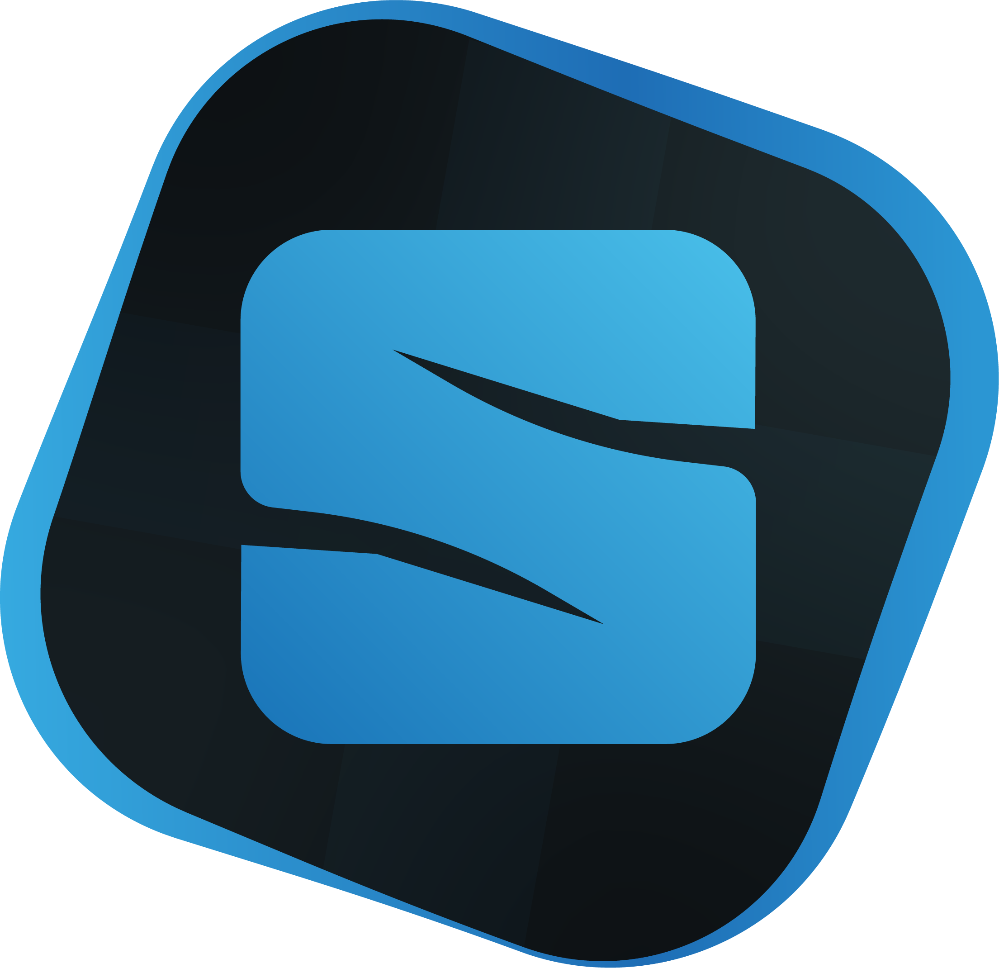
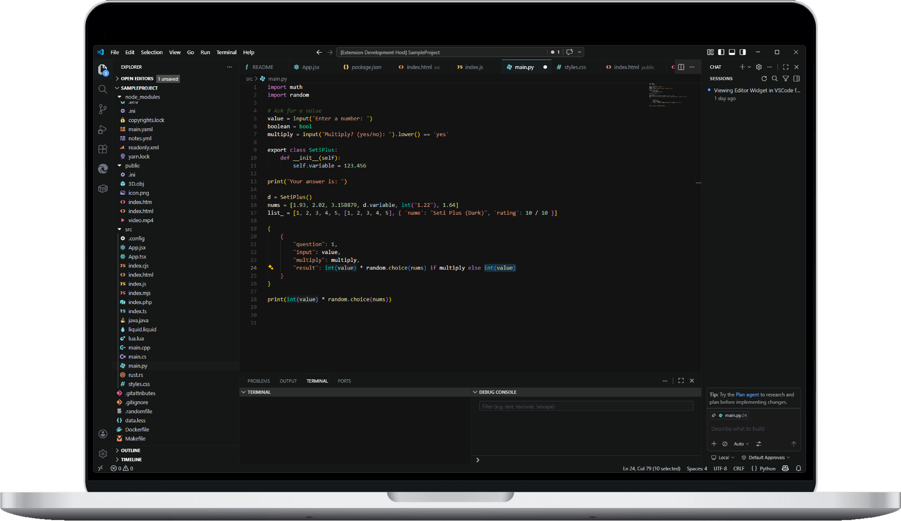
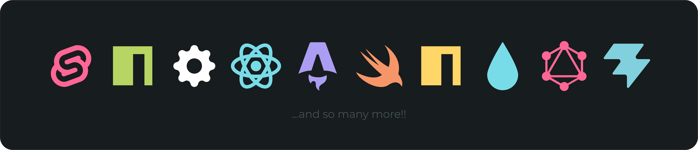
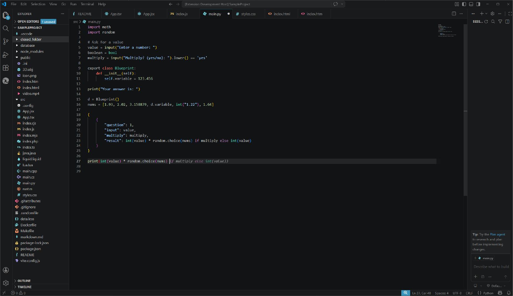
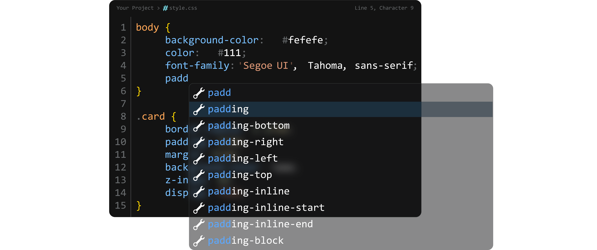

# VS Seti Plus

<p align="center">
  
</p>

<p align="center">
  <i>More functional than the original Seti.<br>Better than Monokai Pro.<br>200+ icons. One stunning dark theme.</i>
</p>

<p align="center">
  <a href="https://marketplace.visualstudio.com/items?itemName=HazeqBinMohsin.vs-seti-plus">
    
  </a>
  
  
</p>

---

<br>

<p align="center">
  
</p>

<br>

---

## ✨ What Makes This Different?

Most icon themes are either minimal to the point of being useless, or so complex they all look the same. **VS Seti Plus** sits exactly where you need it — recognizable at a glance, detailed where it matters, and covering more file types than any theme you've used before.

### 🎯 Over 200 Hand-Crafted Icons

We don't just map random icons to file extensions. Every icon is designed to be instantly recognizable in your file tree:

<p align="center">
  
</p>

**Language Support:**
JavaScript · TypeScript · JSX · TSX · Python · Rust · C · C++ · C# · Java · Go · Ruby · Swift · Kotlin · Scala · R · Dart · Perl · PHP · Lua · SQL · Prisma · GraphQL · HTML · CSS · SCSS · Sass · Less · Stylus · Vue · Svelte · Astro · Solid.js · Markdown · MDX · JSON · YAML · TOML · XML · Shell · PowerShell · Batch · Protocol Buffers · Liquid · Scheme · and more.

**Build & Config:**
Docker · Docker Compose · Makefile · Vite · Babel · ESLint · Prettier · Tailwind · PostCSS · Webpack · EditorConfig · Env · Git (all variants) · NPM/Yarn/PNPM locks · and more.

**Media & Assets:**
Images (PNG, JPG, SVG, WebP, AVIF) · Audio (MP3, WAV, FLAC) · Video (MP4, MOV, WebM) · GIF · 3D Models (OBJ, FBX, STL) · Fonts (TTF, OTF, WOFF2) · PDF · Spreadsheets · Presentations · and more.

**Folder Theming:**
`src` · `components` · `pages` · `layouts` · `hooks` · `utils` · `lib` · `tests` · `docs` · `config` · `migrations` · `node_modules` · `.vscode` — all get distinct folder icons, both collapsed and expanded.

---

## 🌙 VS Seti Plus Dark — Color Theme

Your icon theme now comes with a matching **dark color theme** that doesn't just look good — it works with you, not against you.

<p align="center">
  
</p>

### 🎨 Thoughtful Color Design

| Element | Philosophy |
|---------|-----------|
| **Sidebar** | `#151516` — Dark, but not black. Easy on the eyes at 2 AM. |
| **Editor** | `#131313` — Slightly deeper than the sidebar, keeping your code as the focal point. |
| **Selection** | `#1c2f3d` — A blue-leaning highlight that doesn't scream at you. |
| **Strings** | `#d18762` — Warm copper that stands out from the cool-toned background. |
| **Comments** | `#476639` — Muted forest green that stays out of your way but remains readable. |
| **Widgets** | Translucent — You can still sense what's behind them. |

### 🪟 Translucent Widgets

Suggestions, hovers, the command palette — they all float with subtle translucency:

<p align="center">
  
</p>

---

## 🚀 Setup

### Installation

1. Open VSCode
2. Go to Extensions (`Ctrl+Shift+X` / `Cmd+Shift+X`)
3. Search for **"VS Seti Plus"**
4. Click **Install**

### Activate the Icon Theme

1. Open Command Palette (`Ctrl+Shift+P` / `Cmd+Shift+P`)
2. Type **"File Icon Theme"**
3. Select **"Seti Plus (Dark)"**

### Activate the Color Theme

1. Open Command Palette (`Ctrl+Shift+P` / `Cmd+Shift+P`)
2. Type **"Color Theme"**
3. Select **"VS Seti Plus Dark"**

---

## 🎬 Enhanced Visuals (Optional)

> ⚠️ This step requires the **"Custom CSS and JS Loader"** extension.  
> VSCode restricts extensions from modifying the editor DOM directly for security reasons — this is the same approach used by SynthWave '84 and other popular themes.

To unlock **gradient titlebars, gradient active tabs, and backdrop-filter blur** on editor widgets:

### Step 1: Install the Loader

Install [Custom CSS and JS Loader](https://marketplace.visualstudio.com/items?itemName=be5invis.vscode-custom-css) from the VSCode Marketplace.

### Step 2: Add the CSS Import

Open your `settings.json` (`Ctrl+,` / `Cmd+,`) and add:

```json
"vscode_custom_css.imports": [
  "file:///Users/YOUR_USERNAME/.vscode/extensions/hazeqbinmohsin.vs-seti-plus-1.2.2/custom-css.js"
]
```

> Replace YOUR_USERNAME with your actual username.
>> On Windows, the path looks like: file:///C:/Users/YOUR_USERNAME/.vscode/extensions/hazeqbinmohsin.vs-seti-plus-1.2.2/custom-css.js

### Step 3: Enable & Reload

Open Command Palette (`Ctrl+Shift+P` / `Cmd+Shift+P`)

Run "Enable Custom CSS and JS"

Reload VSCode when prompted

### What you get:

<p align="center"> 
     
</p>

| Feature               | Without CSS	  | With CSS         |
|-----------------------|-----------------|------------------|
| Translucent widgets	| ✅ 75% opacity	  | ✅ 75% + blur     |
| Titlebar gradient	    | ❌ Solid color	  | ✅ Gradient       |
| Active tab gradient	| ❌ Solid color	  | ✅ Gradient       |
| Blur behind dropdowns	| ❌ No blur	      | ✅ Glass effect   | 
<!-- Auto inline suggestions, please fix this table -->

---

## 📸 Screenshots

---

## ⚙️ Extension Settings

This extension contributes the following:

### Icon Theme

- Seti Plus (Dark) — Available under `File Icon Theme`

### Color Theme

- Seti Plus (Dark) — Available under `Color Theme`

> More themes coming soon. Light theme in development.


---


## 🐛 Known Issues

- Widget translucency without blur: Without the optional CSS loader installed, editor widgets (suggest, hover) will be translucent but will not have the `backdrop-filter: blur()` effect. This is a VSCode limitation, not a theme bug. See Enhanced Visuals above.

- Terminal cursor color: Some terminal configurations may override the cursor color. Set `"terminal.integrated.cursorStyle": "line"` if the cursor isn't visible.


---

## 📝 Release Notes

### 1.2.2

- Added VS Seti Plus Dark color theme

- Matching terminal color scheme

- Test file icons added (Jest, Vitest, Cypress, Playwright)

- Expanded folder theming (components, pages, layouts, hooks, utils, lib, migrations)

- Brand new Yarn Lock Icon

- ESLint config no longer uses 3D model icon

- Made different icons for React (JSX) and React (TSX)

### 1.2.0

- Added 40+ new icons (Go, Ruby, Swift, Kotlin, Dart, Svelte, Astro, Fonts, Documents, Archives)

- Added languageIds mapping for language-mode-aware icons

- Support for CSS Modules (*.module.css)

- GraphQL and Protocol Buffer support

### 1.1.0 

- Added media file icons (Audio, Video, 3D Models, Vector)

- Added config file icons (EditorConfig, Babel, PostCSS, Tailwind)

- Added package manager lock file icons (Yarn, PNPM)

- Folder icons for common project directories

### 1.0.0

- Initial release

- 150+ file icons

- Icon theme "Seti Plus (Dark)"

---

## Contributing

Missing an icon? Found a bug? [Open an issue](https://github.com/HazeqBinMohsin/vs-seti-plus/issues) with:

- The file extension

- What framework/language it's for

- (Optional) A reference icon idea

---

<p align="center"> <br> <b>Enjoy!</b> 🎉 <br><br> <i>If you like this extension, please leave a ⭐ review on the marketplace!</i> </p>
